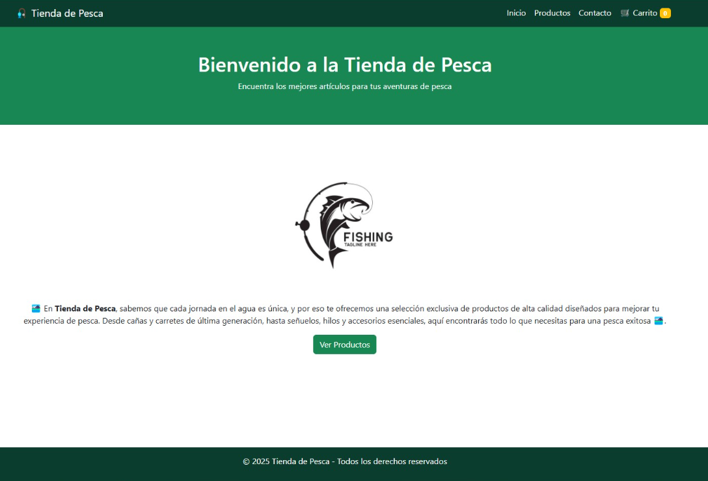
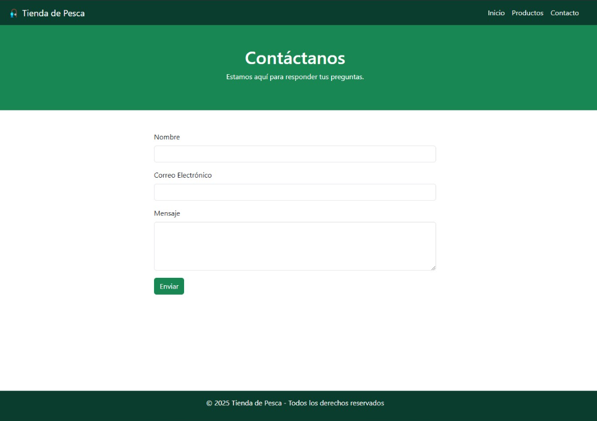
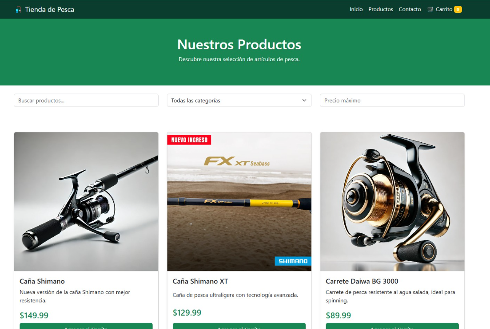

# 🎣 TiendaPesca - Fullstack E-Commerce App

## 📌 Descripción

Fullstack web application for a fishing store (Tienda de Pesca).  
Frontend built with HTML, CSS, JavaScript (Vanilla).  
Backend API developed with Node.js + Express, providing RESTful endpoints for managing products and orders.



## 🗂️ Estructura del Proyecto

```
tienda-pesca/          # Frontend (E-Commerce website)
├── index.html
├── shop.html
├── cart.html
├── product.html
├── css/
├── js/
└── images/

tienda-pesca-api/      # Backend (Node.js + Express API)
├── src/
│   ├── controllers/
│   ├── models/
│   ├── routes/
│   ├── database.js
│   ├── server.js
├── package.json
└── README.md
```

## ⚙️ Funcionalidades



### Frontend (Tienda online)

- Catálogo de productos
- Vista de detalle de producto
- Carrito de la compra (localStorage)
- Responsive design

### Backend (API RESTful)

- CRUD de productos
- Gestión de pedidos
- Autenticación básica
- API documentada con Postman



## 🛠️ Tecnologías utilizadas

- Frontend:

  - HTML5
  - CSS3
  - JavaScript

- Backend:
  - Node.js
  - Express
  - MySQL

## 🛡️ Seguridad

- Sanitización de inputs
- Validación de datos en la API
- Gestión de sesiones segura

## 🚀 Instrucciones para ejecución local

### 1️⃣ Backend (API)

```bash
cd tienda-pesca-api
npm install
npm run dev
```

### 2️⃣ Frontend

Abrir `index.html` en el navegador o servir con extensión como Live Server.

## 🙌 Autor

**Eduard-Ciprian Apatachioae**  
GitHub: [EduZu32](https://github.com/EduZu32)

---

✅ Proyecto finalizado y funcional 🚀  
💬 ¡Con gusto recibo feedback o sugerencias!
